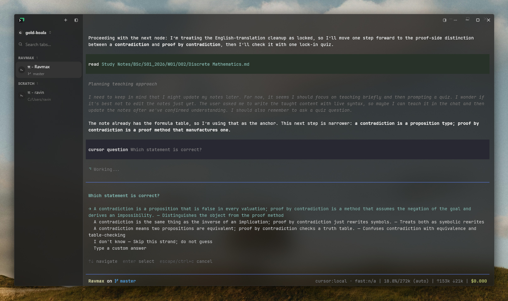
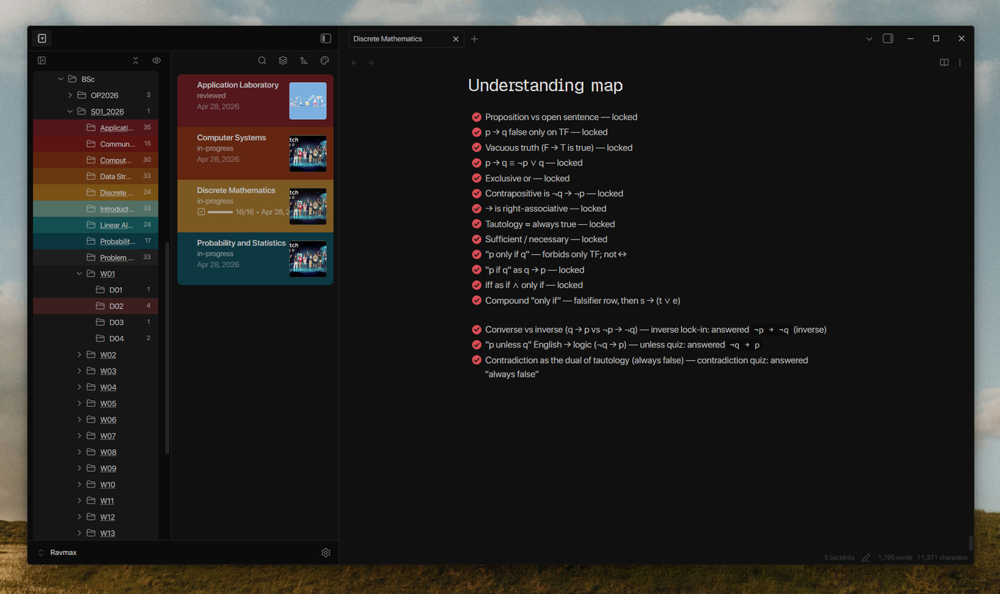
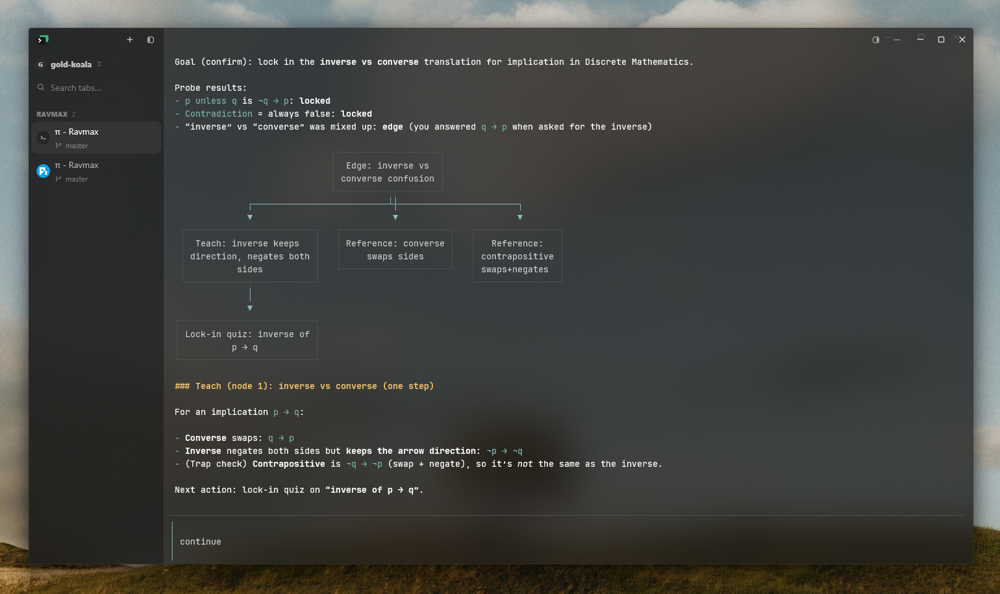

# Primer

<p align="center">
  <strong>A local-first academic vault where Pi probes, teaches, assesses, and records evidence in Obsidian.</strong>
</p>

<p align="center">
  <a href="LICENSE-CODE"></a>
  <a href="LICENSE-CONTENT"></a>
  
  
</p>

- Probes before teaching and records the answer that supports each learning decision.
- Keeps sources, lessons, assessment attempts, review cards, and next actions in one Obsidian vault.
- Uses deterministic scripts for PDF states, record IDs, validation, card decisions, SM-2 dates, course lookup, and Canvas layout.
- Ships as a provider-neutral template with fictional fixtures and a publication safety check.

## Demo

<p align="center">
  
</p>

The included `Foundations of Logic` note demonstrates the complete loop without redistributing lecture material or examination questions:

```text
/study COURSE102 20 "Study Notes/Programme/Y01_S01/W01/D01/Foundations of Logic.md"
      ↓
/exam COURSE102 LEGACY102 "Study Notes/Programme/Y01_S01/W01/D01/Foundations of Logic.md"
      ↓
/research "an unresolved claim" "Research/Claim matrix.md"
```

## Why Primer exists

A chatbot answer disappears into chat history. A normal vault stores information but does not test whether the learner can retrieve or use it. Primer joins the two: Pi runs a closed learning loop while Obsidian keeps the durable artifact, evidence, and source links.

A session starts with diagnosis rather than exposition. It teaches one dependency at a time, requires retrieval or application, grades against a named source, classifies the observed error, and records one next action. Dynamic mastery is derived from attempts instead of being written as free-form learner personality.

## Five commands

| Command | Purpose |
|---|---|
| `/study <course> <minutes> [target-note]` | Probe, teach, practise, validate evidence, and set one next action |
| `/capture [source] [course] [target-note]` | Normalize one source into one note with provenance |
| `/research <question-or-topic> [target-note]` | Build claim–evidence rows before supported prose |
| `/exam <course> [question-or-paper] [target-note]` | Time, grade, classify errors, and choose a card action |
| `/doctor` | Report PDF source states without repairing or rewriting data |

The 25 specialist procedures remain under `vault/.pi/skills/academic-workflow/references/`. They implement the five workflows without cluttering Pi's slash-command list.

## How it works

The model owns questioning, explanation, comparison, and feedback. Standard-library Python utilities own outcomes that should not drift:

- PDF resolution, extraction provenance, status, search, and doctor output
- Evidence validation and stable record IDs
- Latest concept evidence
- Postmortem card actions
- SM-2 scheduling
- Course-code lookup
- Canvas coordinates and merges

The repository root contains release documentation, assets, tests, and a read-only verifier. Open `vault/` directly in Obsidian and launch Pi from that directory. Pi discovers project resources under `vault/.pi/`.

## Install

1. Clone this repository with GitHub's **Code** menu.
2. Verify the checkout before opening it:

   ```bash
   cd Primer
   python scripts/verify.py
   ```

   Use `python3` on macOS or Linux when required.

3. Install Pi and the packages listed in `vault/.pi/settings.json`.
4. Open `Primer/vault/` as an Obsidian vault.
5. Start Pi inside that folder:

   ```bash
   cd vault
   pi
   ```

6. Review Pi's project trust prompt, open `START HERE.md`, and run `/doctor`.

See the [setup guide](docs/setup.md) for portable paths, optional packages, PDF tools, and OS notes.

## First five minutes

1. Open `vault/START HERE.md`.
2. Open the fictional `Foundations of Logic.md` day note.
3. Confirm its `Lecture Notes.base` view includes the note.
4. Run `/doctor` and inspect the source-state report.
5. Run one 20-minute `/study` session against the demo note.
6. Inspect the appended `academic-evidence` record, then reset the fictional note with Git.

Primer does not bundle custom CSS, third-party themes, or community plugin binaries. The screenshots use a local Obsidian setup; the default theme works.

## Example workflows

| Goal | Command |
|---|---|
| Learn one topic | `/study COURSE102 45 <target-note>` |
| Capture a lecture or PDF | `/capture <source> COURSE102 <target-note>` |
| Investigate a disputed claim | `/research <question> <target-note>` |
| Run timed paper practice | `/exam COURSE102 <question-or-paper> <target-note>` |
| Check source health | `/doctor` |

The [workflow guide](docs/workflows.md) defines evidence, grading, card, and write rules.

## What is included

```text
Primer/
├── README.md
├── LICENSE-CODE
├── LICENSE-CONTENT
├── CHANGELOG.md
├── CONTRIBUTING.md
├── assets/
├── docs/
├── scripts/verify.py
├── tests/
└── vault/
    ├── START HERE.md
    ├── .obsidian/       portable settings only
    ├── .pi/             five prompts, skills, tutor profile, guard, scripts
    ├── Templates/
    ├── Study Notes/     generic term structure and fictional demo
    └── Papers & Reviews/
```

<p align="center">
  
</p>

<p align="center">
  
</p>

Screenshots show an example Pi and Obsidian setup. Provider, terminal, theme, and local content may differ.

## Evidence and cards

Assessment errors use exactly:

- `recall`
- `concept`
- `translation`
- `procedure`
- `calculation`
- `misread`
- `incomplete-justification`
- `time-management`

The deterministic card action is `create`, `revise`, `suspend`, or `none`. Recall and concept failures may justify cards; other errors normally justify targeted practice. Cards are not generated from source text or inferred weakness.

## PDF truth model

Every indexed source is one of:

- `indexed`
- `missing_target`
- `unsupported_uri`
- `unreadable`
- `no_text_layer`
- `ocr_pending`
- `failed`

Only `no_text_layer` is an OCR candidate. For a scanned PDF++ placeholder,
`ocr-pages` resolves the linked real PDF, rasterizes it under
`.pi/cache/pdf-index/ocr/`, and returns ordered images for the vision/OCR pass.
Missing targets are source-repair work, not OCR work.

## Customization

Start with `vault/.pi/LEARNER.md`, then replace the fictional term, course, and crosswalk fixtures one course at a time. Keep the five public commands and customize their internal references. The [customization guide](docs/customization.md) covers paths, evidence schemas, and source backends.

## Requirements and compatibility

| Component | Status | Compatibility |
|---|---|---|
| Obsidian | Required | 1.13.0 or newer; Bases and Canvas enabled |
| Node.js | Required for Pi | 22.19.0 or newer, per Pi 0.84.2 metadata |
| Pi | Required | Tested with 0.84.2 |
| Python | Required for deterministic helpers | 3.10 or newer; standard library only |
| `pi-obsidian` | Required for documented vault tools | Distribution setting |
| `pi-ask-user` | Required for model-callable questions | Distribution setting |
| Windows, macOS, Linux | Supported | Platform-specific commands are documented in setup |
| Poppler PDF tools | Required for PDF workflows | `pdftotext` for text; `pdftoppm` for scan rendering |
| Zotero and web tools | Optional | Install only for workflows that use them |

## Privacy and security

Obsidian files remain local unless the user enables sync. Hosted model calls may send prompts, selected note text, tool output, and attachments to the configured provider. Optional source and sync tools have separate data access.

Primer includes no provider credentials, student records, institutional course data, source corpus, workspace state, sync settings, plugin binaries, themes, or generated caches. The guard blocks common sensitive filenames. `scripts/verify.py` rejects generated state, personal paths, private template values, stale commands, missing workflow resources, invalid JSON, and broken launch-document links.

Keep credentials, recovery material, private keys, tokens, and `.env` files outside the vault. Review the model provider's retention and training terms before using private notes.

## Limitations

- Course crosswalks require human review when curricula change.
- Primer cannot claim an official mark without an authoritative marking source.
- Scan-only PDFs require Poppler page rendering and a vision/OCR pass before search.
- Obsidian can display due cards on mobile, but Pi performs interactive grading in a terminal.
- Screenshots and optional visual themes are examples, not bundled runtime requirements.

## Verification

```bash
python -m unittest discover -s tests -v
bun test tests/guard.test.mjs
python scripts/verify.py
```

## Credit, licenses, and contributing

Primer adapts the probe → plan → teach → check protocol from [vasanthsreeram/Alvarmethod](https://github.com/vasanthsreeram/Alvarmethod), released under MIT. Alvarmethod credits [Eero Alvar's "How I Use AI to Learn Things"](https://youtu.be/kzcI5F4tGiU). Primer adds an Obsidian storage model, deterministic evidence and source utilities, assessment postmortems, card decisions, and release safety checks. No endorsement is implied.

- Code, scripts, and Pi extensions: [MIT](LICENSE-CODE)
- Original documentation, templates, fictional examples, and visual assets: [CC BY 4.0](LICENSE-CONTENT)
- Contributions: [CONTRIBUTING.md](CONTRIBUTING.md)
