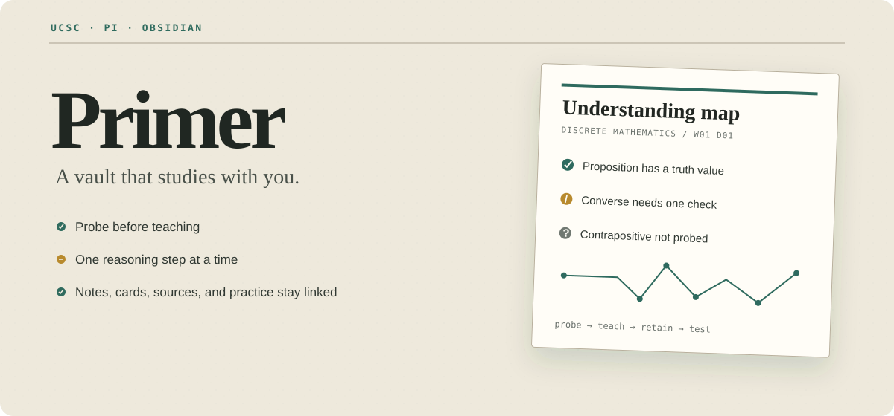
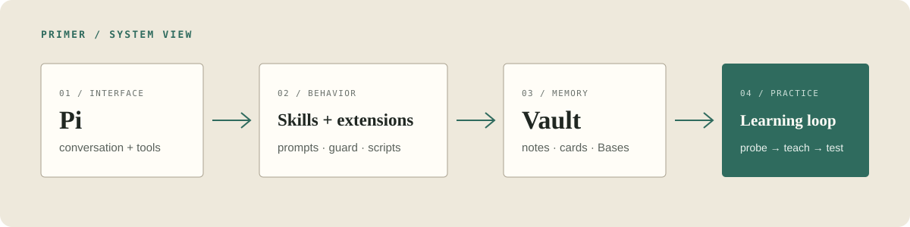

<p align="center">
  
</p>

<p align="center">
  <strong>A local-first academic vault where Pi probes what you know, teaches one step, and writes the result back to Obsidian.</strong>
</p>

<p align="center">
  <a href="LICENSE-CODE"></a>
  <a href="LICENSE-CONTENT"></a>
  
  
</p>

- Probes the edge of a learner's understanding before teaching.
- Keeps lessons, source links, understanding maps, review cards, and exam practice in one Obsidian vault.
- Uses scripts for SM-2 dates, course-code lookup, PDF indexing, Zotero reads, and Canvas layout instead of asking a model to guess.
- Ships as a provider-neutral UCSC template with one fictional course demo and a publication safety check.

## Demo

<p align="center">
  
</p>

The included Discrete Mathematics note demonstrates the full loop without redistributing a lecture, textbook page, or examination question:

```text
/probe Discrete Mathematics
      ↓
/teach Discrete Mathematics
      ↓
/cards Study Notes/BSc/S01_2026/W01/D01/Discrete Mathematics.md
      ↓
/review Discrete Mathematics
```

## Why Primer exists

A chatbot answer disappears into chat history. A normal vault records information but does not test whether the learner can retrieve or use it. Primer joins the two: Pi runs the learning loop, while Obsidian keeps the durable artifact and its links.

The workflow starts with a diagnosis. It then teaches one dependency at a time, checks it through a picker, and records only what the learner has worked through. Cards and paper practice point back to the source note.

## What it does

- `/probe` labels strands as known, edge, unknown, or blocked.
- `/teach` shows a Mermaid dependency plan, teaches one step, and asks one lock-in question.
- `/cards` and `/review` maintain vault-native SM-2 cards visible through an Obsidian Base.
- `/exercises`, `/classify`, `/mock`, and `/postmortem` connect learning to practice without writing student submissions.
- `/overview`, `/gap`, `/find`, and `/cite` organize sources and maps when their optional tools are configured.

## How it works

<p align="center">
  
</p>

The repository root contains release documentation, assets, tests, and a read-only verifier. Open `vault/` directly in Obsidian and launch Pi from that same directory. Pi auto-discovers the project resources under `vault/.pi/`.

## Install

1. Clone this repository with GitHub's **Code** menu.
2. Check the checkout before opening it:

   ```bash
   cd Primer
   python scripts/verify.py .
   ```

   Use `python3` on macOS or Linux when needed.

3. Install Pi and the two core packages:

   ```bash
   npm install -g --ignore-scripts @earendil-works/pi-coding-agent
   pi install npm:pi-obsidian
   pi install npm:pi-ask-user
   ```

4. Open `Primer/vault/` as an Obsidian vault.
5. Start Pi inside that folder:

   ```bash
   cd vault
   pi
   ```

6. Review Pi's project trust prompt, then open `START HERE.md`.

See the [setup guide](docs/setup.md) for provider login, optional packages, PDF tools, Zotero, themes, and OS notes.

## First five minutes

1. Open `vault/START HERE.md`.
2. Open the fictional `W01/D01/Discrete Mathematics.md` demo.
3. Confirm its course Base lists the note.
4. Run `/probe Discrete Mathematics` and select the demo note.
5. Run one `/teach` step and inspect `Study Notes/Review/Due.base`.

Primer does not bundle custom CSS, third-party themes, or community plugin binaries. The screenshots use [Minimal](https://github.com/kepano/obsidian-minimal); [Baseline](https://github.com/aaaaalexis/obsidian-baseline) is a tested alternative. Obsidian's default theme also works.

## Example workflows

| Goal | Path |
|---|---|
| Learn a lecture topic | `/probe` → `/teach` → `/cards` → `/review` |
| Repair a weak explanation | `/feynman <note>` → targeted `/teach` → `/cards` |
| Practice before an exam | `/classify` → `/mock` → `/postmortem` |
| Build a course map | `/overview <course>` → script layout → Canvas review |
| Trace a claim | `/source <claim>` or `/find <query>` with configured sources |

The [workflow guide](docs/workflows.md) states the file and grading rules for each path.

## What is included

```text
Primer/
├── README.md
├── LICENSE-CODE
├── LICENSE-CONTENT
├── CHANGELOG.md
├── CONTRIBUTING.md
├── assets/
├── docs/
├── scripts/verify.py
├── tests/
└── vault/
    ├── START HERE.md
    ├── .obsidian/       portable settings only
    ├── .pi/             prompts, skills, agent, guard, scripts
    ├── Templates/
    ├── Study Notes/     UCSC structure and fictional demo
    └── Papers & Reviews/
```

<p align="center">
  
</p>

<p align="center">
  
</p>

Screenshots show the author's local Pi and Obsidian setup with example learning content. Provider and terminal interfaces may differ.

## Customization

Start with `vault/.pi/LEARNER.md`, then add one course and verify its Base before migrating more notes. Keep course filenames, card frontmatter, and source links stable. The [customization guide](docs/customization.md) covers semester paths, providers, guard patterns, optional themes, and plugins.

## Requirements and compatibility

| Component | Core status | Compatibility |
|---|---|---|
| Obsidian | Required | 1.13.0 or newer; Bases and Canvas core plugins enabled |
| Node.js | Required to install/run Pi | 22.19.0 or newer, per Pi 0.84.2 package metadata |
| Pi | Required | Tested with 0.84.2 |
| Python | Required for deterministic helpers | 3.10 or newer; standard library only |
| `pi-obsidian` | Required for documented vault tools | Observed 0.2.3 |
| `pi-ask-user` | Required for model-callable quiz picker | Observed 0.14.0 |
| Windows | Supported | Use `python`; add optional binaries to `PATH` |
| macOS | Supported | `python3`; Homebrew can install Poppler and Pandoc |
| Linux | Supported | `python3`; distro packages can install Poppler and Pandoc |
| Minimal / Baseline | Optional | Referenced only; not bundled or required |
| PDF, Zotero, web, sub-agents | Optional | Install only for the workflows that use them |

Cross-platform script contracts run in CI-ready unit tests. The current manual desktop smoke check is performed on Windows; macOS and Linux support rests on path-safe code and platform-specific setup instructions until maintainers record native smoke checks.

## Privacy and security

Obsidian files remain local unless the user enables sync. Pi itself is local software, but a hosted model call can send prompts, selected note text, tool output, and attachments to the configured provider. Optional web, PDF, Zotero, provider, and sync tools have separate data access and network behavior.

Primer does not include provider credentials, student data, real lecture content, paper corpora, workspace state, sync settings, plugin binaries, themes, or caches. The guard extension blocks common sensitive filenames. `scripts/verify.py` rejects generated state, personal paths, secret-like filenames, invalid JSON, and broken launch-document links before release.

A guard is not a credential store. Keep credentials, recovery material, private keys, tokens, and `.env` files outside the vault. Review your model provider's retention and training terms before using private course notes.

## Limitations

- Primer is not affiliated with or endorsed by the University of Colombo School of Computing.
- The course-code crosswalk needs human review when a syllabus changes.
- BSc marking schemes are not included. Primer cannot claim an official mark without one.
- Scan-only PDFs need OCR before search. Empty extraction must stay empty rather than becoming invented content.
- Obsidian can display due cards on mobile, but Pi performs interactive grading in a terminal.
- Themes and provider interfaces shown in screenshots are not part of the package.

## Troubleshooting

Read [docs/troubleshooting.md](docs/troubleshooting.md). The fastest checks are:

```bash
python scripts/verify.py .
python -m unittest discover -s tests -v
node --test tests/guard.test.mjs
```

## Credit, licenses, and contributing

Primer adapts the probe → plan → teach → lock-in protocol from [vasanthsreeram/Alvarmethod](https://github.com/vasanthsreeram/Alvarmethod), released under MIT. Alvarmethod credits [Eero Alvar's "How I Use AI to Learn Things"](https://youtu.be/kzcI5F4tGiU) for the published learning loop. Primer changes the storage model, commands, review system, course crosswalk, and safety rules for an Obsidian-based UCSC workflow. No endorsement is implied.

- Code, scripts, and Pi extensions: [MIT](LICENSE-CODE)
- Original documentation, templates, fictional examples, and visual assets: [CC BY 4.0](LICENSE-CONTENT)
- Contributions: [CONTRIBUTING.md](CONTRIBUTING.md)
