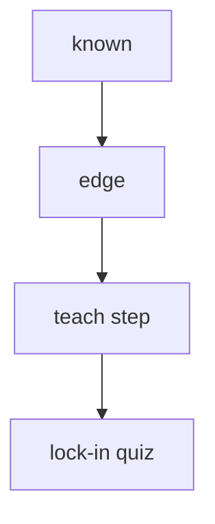

# Markdown Snippets.md (live subset for this product kit)

This is a minimal, product-safe subset of the vault’s live rendering dialect.
The tutor protocol and skills assume only the syntax below is emitted.

## Strict line breaks

`strictLineBreaks: true` — a single newline does not render. Use two trailing spaces
or a blank line between lines.

## Callouts

Live types used by the tutor loop:

- `> [!note]` definitions
- `> [!question]` exam traps / “which is NOT…”
- `> [!Equation]` derivations (wrap display math)

Example:

```md
> [!Equation]
$$
\\text{some derivation here}
$$
```

## Understanding map checkboxes

Use this extended checkbox set:

- `- [x]` known
- `- [/]` edge
- `- [?]` unknown
- `- [!]` blocked

## Mermaid

Standard fenced ` ```mermaid ` blocks render natively:



## TikZ

Use fenced ` ```tikz ` blocks (only when the picture *is* the claim):

```tikz
\\begin{document}
% ...
\\end{document}
```

## pdf++ links (required for page evidence)

When citing a PDF page/region, use:

```md
[[<Name>.pdf#page=<N>&rect=<x,y,w,h>|<Name>, p.<N>]]
```

If you only know the page number, page-only is allowed:

```md
[[<Name>.pdf#page=<N>|<Name>, p.<N>]]
```

Embed vs link:

```md
![[<Name>.pdf#page=<N>|<Name>, p.<N>]]
```

Never invent `rect=` coordinates.

## cardlink

For a YouTube/course card, emit a fenced ` ```cardlink ` block:

```cardlink
url: https://example.com/video
title: Video title
```

## Bases (`.base`) dynamic views

Dynamic views are YAML-backed Bases. Examples of common filters:

```yaml
filters:
  and:
    - file.name == "Foundations of Logic"
```

For the spaced repetition queue:

```yaml
filters:
  and:
    - due <= today()
```

## Math

Inline `$x^2$` and display `$$ ... $$`. For multi-line derivations, use `align*`:

```md
$$
\\begin{align*}
...
\\end{align*}
$$
```

