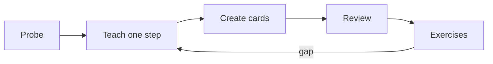

# Primer command desk

New here? Open [[START HERE]].

## Learning loop

| Command | Use |
|---|---|
| `/probe <course> [note]` | Map known, edge, unknown, and blocked strands without teaching. |
| `/teach <course> [note]` | Plan, teach one reasoning step, and ask a lock-in question. |
| `/cards <note>` | Convert locked or edge ideas into atomic review cards. |
| `/review [course] [count]` | Drill due cards and let `sm2.py` schedule the result. |
| `/exercises <course> [topic]` | Retrieve practice material; keep assignment answers learner-authored. |
| `/classify <course>` | Organize real or fictional paper questions by topic after checking the course crosswalk. |
| `/mock <course> [minutes]` | Run timed practice one question at a time. |
| `/postmortem <mock>` | Separate knowledge gaps, misconceptions, and careless errors. |
| `/overview <course>` | Build or merge a concept Canvas with script-owned coordinates. |
| `/gap <course>` | Find source material that has no matching day note. |

## File rules

- Day notes live under `Study Notes/BSc/S01_2026/W##/D##/`.
- A day note's filename must equal the course name used by `Lecture Notes.base`.
- Review cards live under `Study Notes/Review/<Course>/` and link back through `source`.
- Attachments live under `Bin/`.
- Agents work on one named note per turn.
- Credentials, recovery material, private keys, tokens, and `.env` files do not belong in the vault.

## Demo

Open [[Study Notes/BSc/S01_2026/W01/D01/Discrete Mathematics]]. Every included question and explanation is a fictional Primer example, not UCSC course or examination content.
