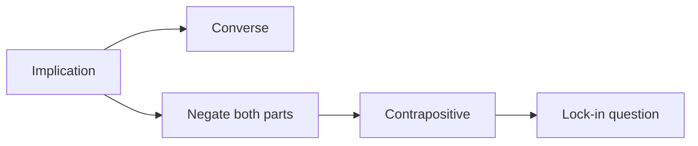

# Foundations of Logic

> [!info] Fictional Primer demo
> Primer's authors wrote every question and explanation in this note. It is not copied from a Example University lecture, textbook, or examination.

## Session target

Distinguish an implication from its converse and contrapositive.

## Understanding map

- [x] A proposition has a truth value — locked
- [/] Converse of an implication — needs one check
- [?] Contrapositive — not yet probed
- [!] Proof by contradiction — outside this demo's prerequisites

## Teaching plan

## Locked explanation

For $p \to q$:

- the **converse** swaps the parts: $q \to p$;
- the **contrapositive** swaps and negates them: $\neg q \to \neg p$.

An implication and its contrapositive are logically equivalent. Its converse need not be.

> [!question] Fictional lock-in
> If "a number is divisible by 4, then it is even" is the implication, which statement is its contrapositive?

## Review cards

- [[Study Notes/Review/Foundations of Logic/Implication]]
- [[Study Notes/Review/Foundations of Logic/Contrapositive]]

## Next action

Run `/probe Foundations of Logic` and use this note as the target. Keep all generated demo work below this line or reset the file from Git when finished.
